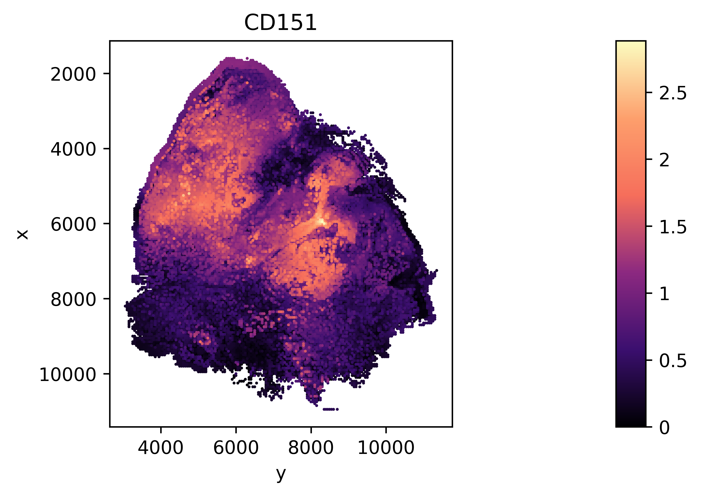
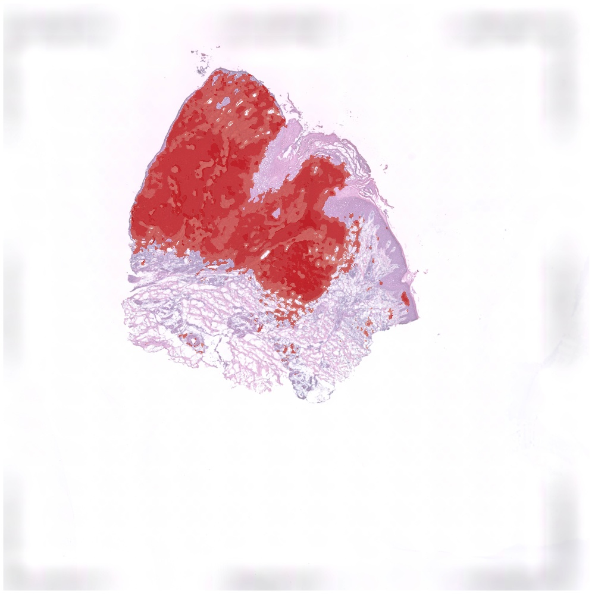
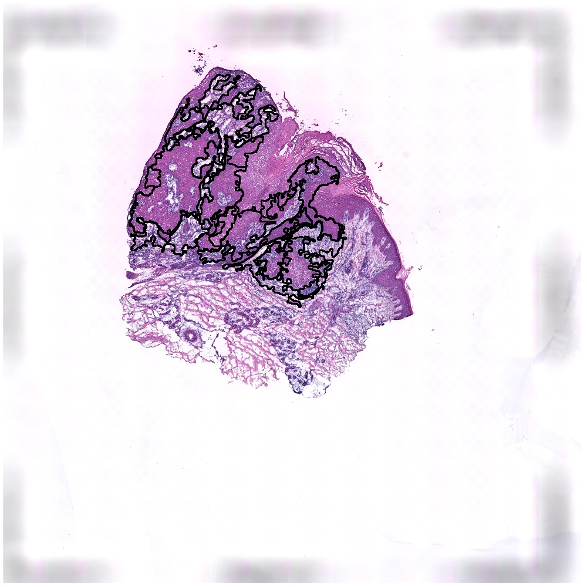
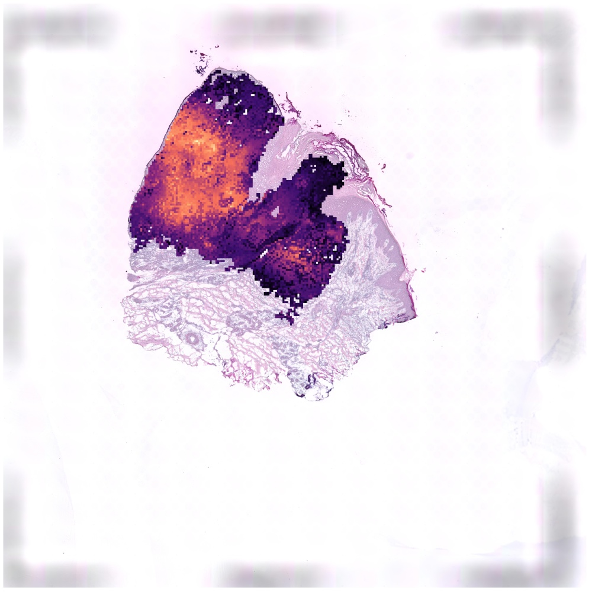
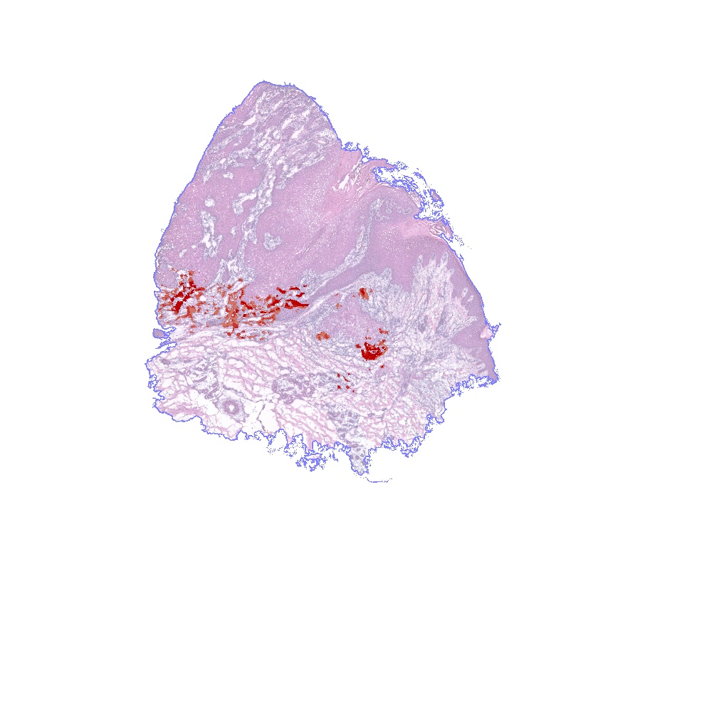

<h1><center>TESLA Tutorial</center></h1>


<center>Author: Jian Hu*,  Kyle Coleman, Edward B. Lee, Humam Kadara, Linghua Wang*, Mingyao Li*

## Outline
#### 1. [Installation](https://github.com/jianhuupenn/TESLA/blob/main/tutorial/tutorial.md#1-installation-1)
#### 2. [Import modules](https://github.com/jianhuupenn/TESLA/blob/main/tutorial/tutorial.md#2-import-python-modules)
#### 3. [Read in data](https://github.com/jianhuupenn/TESLA/blob/main/tutorial/tutorial.md#3-read-in-data-1)
#### 4. [Gene expression enhancement](https://github.com/jianhuupenn/TESLA/blob/main/tutorial/tutorial.md#4-gene-expression-enhancement-1)
#### 5. [Region annotation](https://github.com/jianhuupenn/TESLA/blob/main/tutorial/tutorial.md#5-region-annotation-1)
#### 6. [Characterize the intra-tumor heterogeneity](https://github.com/jianhuupenn/TESLA/blob/main/tutorial/tutorial.md#6-characterize-the-intra-tumor-heterogeneity-1)
#### 7. [TLS detection](https://github.com/jianhuupenn/TESLA/blob/main/tutorial/tutorial.md#7-tls-detection-1)

### 1. Installation
To install TESLA package you must make sure that your python version is over 3.5.=. If you don’t know the version of python you can check it by:


```python
import platform
platform.python_version()
```


    '3.8.8'


Note: Because TESLA pends on pytorch, you should make sure torch is correctly installed.
<br>
Now you can install the current release of TESLA by the following three ways:
#### 1.1 PyPI: Directly install the package from PyPI.


```python
pip3 install TESLAforST
#If you do not have permission (when you get a permission denied error), you should install TESLA by
pip3 install --user TESLAforST
```

#### 1.2 Github
Download the package from Github and install it locally:


```python
git clone https://github.com/jianhuupenn/TESLA
cd ./TESLA/TESLA_package/
python3 setup.py install --user
```

#### 1.3 Anaconda ()
If you do not have Python3.5 or Python3.6 installed, consider installing Anaconda (see Installing Anaconda). After installing Anaconda, you can create a new environment, for example, TESLA (you can change to any name you like).


```python
#create an environment called TESLA
conda create -n TESLA python=3.7.9
#activate your environment 
conda activate TESLA
git clone https://github.com/jianhuupenn/TESLA
cd TESLA/TESLA_package/
python3 setup.py build
python3 setup.py install
conda deactivate
```

### 2. Import python modules


```python
import os,csv,re, time
import pickle
import random
import warnings
warnings.filterwarnings('ignore')
import pandas as pd
import numpy as np
from scipy import stats
from scipy.sparse import issparse
import scanpy as sc
import matplotlib.colors as clr
import matplotlib.pyplot as plt
import cv2
import TESLA as tesla
from IPython.display import Image
```


```python
tesla.__version__
```


    '1.2.2'


### 3. Read in data
The current version of TESLA requres three input data.
<br>
<br>
1. The gene expression matrix(n by k): expression_matrix.h5;
<br>
2. Spatial coordinateds of samplespositions.txt;
<br>
3. Histology image(optional): histology.tif, can be tif or png or jepg.
<br>
The gene expreesion data can be stored as an AnnData object. AnnData stores a data matrix .X together with annotations of observations .obs, variables .var and unstructured annotations .uns. 


```python
"""
#Read original 10x_h5 data and save it to h5ad
from scanpy import read_10x_h5
adata = read_10x_h5("../tutorial/data/151673/expression_matrix.h5")
spatial=pd.read_csv("../tutorial/data/151673/positions.txt",sep=",",header=None,na_filter=False,index_col=0) 
adata.obs["x1"]=spatial[1]
adata.obs["x2"]=spatial[2]
adata.obs["x3"]=spatial[3]
adata.obs["x4"]=spatial[4]
adata.obs["x5"]=spatial[5]
#Select captured samples
adata=adata[adata.obs["x1"]==1]
adata.var_names=[i.upper() for i in list(adata.var_names)]
adata.var["genename"]=adata.var.index.astype("str")
adata.write_h5ad("../tutorial/data/151673/sample_data.h5ad")
"""
#Read in gene expression and spatial location
counts=sc.read("./data/sample_data.h5ad")
#Read in hitology image
img=cv2.imread("./data/sample_H&E.jpg")
```

### 4. Gene expression enhancement

#### 4.1 Preprocessing


```python
resize_factor=1000/np.min(img.shape[0:2])
resize_width=int(img.shape[1]*resize_factor)
resize_height=int(img.shape[0]*resize_factor)
counts.var.index=[i.upper() for i in counts.var.index]
counts.var_names_make_unique()
counts.raw=counts
sc.pp.log1p(counts) # impute on log scale
if issparse(counts.X):counts.X=counts.X.A
```

#### 4.2 Contour detection


```python
#Three different algorithms to detect contour, select the best one.Here we use cv2.
#Important note: If you get incorrect contour for all of the 3 three methods, please double check your array_x, array_y, pixel_x, pixel_y are matched correctly.

#-----------------1. Detect contour using cv2-----------------
cnt=tesla.cv2_detect_contour(img, apertureSize=5,L2gradient = True)

#-----------------2. Scan contour by x-----------------
spots=counts.obs.loc[:, ['pixel_x', 'pixel_y', "array_x", "array_y"]]
#shape="hexagon" for 10X Vsium, shape="square" for ST
cnt=tesla.scan_contour(spots, scan_x=True, shape="hexagon")

#-----------------3. Scan contour by y-----------------
spots=counts.obs.loc[:, ['pixel_x', 'pixel_y', "array_x", "array_y"]]
#shape="hexagon" for 10X Vsium, shape="square" for ST
cnt=tesla.scan_contour(spots, scan_x=False, shape="hexagon")

binary=np.zeros((img.shape[0:2]), dtype=np.uint8)
cv2.drawContours(binary, [cnt], -1, (1), thickness=-1)
#Enlarged filter
cnt_enlarged = tesla.scale_contour(cnt, 1.05)
binary_enlarged = np.zeros(img.shape[0:2])
cv2.drawContours(binary_enlarged, [cnt_enlarged], -1, (1), thickness=-1)
img_new = img.copy()
cv2.drawContours(img_new, [cnt], -1, (255), thickness=50)
img_new=cv2.resize(img_new, ((resize_width, resize_height)))
cv2.imwrite('./results/cnt.jpg', img_new)
Image(filename='./results/cnt.jpg')
```


    

    


#### 4.3 Gene expression enhancement


```python
#Set size of superpixel
res=50
# Note, if the numer of superpixels is too large and take too long, you can increase the res to 100
enhanced_exp_adata=tesla.imputation(img=img, raw=counts, cnt=cnt, genes=counts.var.index.tolist(), shape="None", res=res, s=1, k=2, num_nbs=10)
```

    Trying to set attribute `.obs` of view, copying.


    Total number of sudo points:  19988
    Calculating spot 0
    Calculating spot 1000
    Calculating spot 2000
    Calculating spot 3000
    Calculating spot 4000
    Calculating spot 5000
    Calculating spot 6000
    Calculating spot 7000
    Calculating spot 8000
    Calculating spot 9000
    Calculating spot 10000
    Calculating spot 11000
    Calculating spot 12000
    Calculating spot 13000
    Calculating spot 14000
    Calculating spot 15000
    Calculating spot 16000
    Calculating spot 17000
    Calculating spot 18000
    Calculating spot 19000
    --- 76.97813606262207 seconds ---
    Imputing spot 0
    Imputing spot 1000
    Imputing spot 2000
    Imputing spot 3000
    Imputing spot 4000
    Imputing spot 5000
    Imputing spot 6000
    Imputing spot 7000
    Imputing spot 8000
    Imputing spot 9000
    Imputing spot 10000
    Imputing spot 11000
    Imputing spot 12000
    Imputing spot 13000
    Imputing spot 14000
    Imputing spot 15000
    Imputing spot 16000
    Imputing spot 17000
    Imputing spot 18000
    Imputing spot 19000


#### 4.4 Plot  gene expression image


```python
cnt_color = clr.LinearSegmentedColormap.from_list('magma', ["#000003",  "#3b0f6f",  "#8c2980",   "#f66e5b", "#fd9f6c", "#fbfcbf"], N=256)
g="CD151"
enhanced_exp_adata.obs[g]=enhanced_exp_adata.X[:,enhanced_exp_adata.var.index==g]
fig=sc.pl.scatter(enhanced_exp_adata,alpha=1,x="y",y="x",color=g,color_map=cnt_color,show=False,size=10)
fig.set_aspect('equal', 'box')
fig.invert_yaxis()
plt.gcf().set_dpi(600)
fig.figure.show()
```


    

    


#### 4.5 Save results


```python
enhanced_exp_adata.write_h5ad("./results/enhanced_exp.h5ad")
```

### 5. Region annotation

#### 5.1 Target region annotation
Prefer choosing 5 to 10 marker genes.
<br>
The default num_required=1.  If you include one gene that is not that specific (also highly expressed in other cell types), num_required+=1. For example, if you include 2 non-specific markers, please set num_required=3. 
Please drop genes with all 0 expression from the list since they are not infomrative.

```python
#Select your gene list
#For example, if we want to annotate tumor region, use tumor markers
genes=['BUB1B', 'KIF1C','TOP2A', 'CD151', 'MMP10', 'PTHLH','FEZ1','IL24','KCNMA','INHBA','MAGEA4','NT5E','LAMC2','SLITRK6']
genes=list(set([i for i in genes if i in enhanced_exp_adata.var.index ]))
#target_size can be set to "small" or "large".
pred_refined, target_clusters, c_m=tesla.annotation(img=img, 
                                                    binary=binary,
                                                    sudo_adata=enhanced_exp_adata, 
                                                    genes=genes, 
                                                    resize_factor=resize_factor,
                                                    num_required=1, 
                                                    target_size="small")
#Plot
ret_img=tesla.visualize_annotation(img=img, 
                              binary=binary, 
                              resize_factor=resize_factor,
                              pred_refined=pred_refined, 
                              target_clusters=target_clusters, 
                              c_m=c_m)

cv2.imwrite('./results/tumor.jpg', ret_img)
Image(filename='./results/tumor.jpg')
```

    Computing image band...
    Computing gene band...
    Running TESLA...
    0 / 30 |  label num : 100 |  main clusters : 65  | feature loss : 6.286277770996094  | spatial loss : 2.477134943008423
    --- 79.8510057926178 seconds ---
    1 / 30 |  label num : 75 |  main clusters : 30  | feature loss : 4.300119400024414  | spatial loss : 0.44662031531333923
    --- 136.36640787124634 seconds ---
    mainLabels 30 reached minLabels 30 .
    Finding target clusters...
    c_m:
    [(6, 0.660496668592895), (2, 0.5849543163588522), (15, 0.5158497030203698), (19, 0.48606369815923994), (12, 0.4802130752317957), (10, 0.4580134991936973), (4, 0.45732190334046835), (14, 0.43235966925018005), (17, 0.3388222879213612), (13, 0.3331709370762233), (16, 0.3160079580858375), (9, 0.2478758789018975), (8, 0.21917223597411475), (7, 0.20651287130232146), (3, 0.19796864337328288), (11, 0.19742332922793465), (20, 0.15788060926103378), (1, 0.14535831267938887), (5, 0.1265518524797657), (18, 0.024549401709053432), (0, 0.0)]
    Target clusters:
    [6, 2, 15, 19, 12, 10, 4, 14, 17, 13]


    

    


#### 5.2 Save results


```python
#Save
np.save("./results/tumor_annotation.npy", pred_refined)
print("Target_clusters: ", target_clusters, "\n")
#Save the cluster density information
c_d={i[0]:i[1] for i in c_m[0:len(target_clusters)]}
print("Cluster_density : ", c_d)
with open('./results/tumor_annotation_c_d.pkl', 'wb') as f: pickle.dump(c_d, f)

```

    Target_clusters:  [6, 2, 15, 19, 12, 10, 4, 14, 17, 13] 
    
    Cluster_density :  {6: 0.660496668592895, 2: 0.5849543163588522, 15: 0.5158497030203698, 19: 0.48606369815923994, 12: 0.4802130752317957, 10: 0.4580134991936973, 4: 0.45732190334046835, 14: 0.43235966925018005, 17: 0.3388222879213612, 13: 0.3331709370762233}


### 6. Characterize the intra-tumor heterogeneity

#### 6.1 Read in saved results


```python
enhanced_exp_adata=sc.read("./results/enhanced_exp.h5ad")
pred_refined=np.load("./results/tumor_annotation.npy")
target_clusters=[6, 2, 15, 19, 12, 10, 4, 14, 17, 13]
c_m= [(6, 0.660496668592895), (2, 0.5849543163588522), (15, 0.5158497030203698), (19, 0.48606369815923994), (12, 0.4802130752317957), (10, 0.4580134991936973), (4, 0.45732190334046835), (14, 0.43235966925018005), (17, 0.3388222879213612), (13, 0.3331709370762233), (16, 0.3160079580858375), (9, 0.2478758789018975), (8, 0.21917223597411475), (7, 0.20651287130232146), (3, 0.19796864337328288), (11, 0.19742332922793465), (20, 0.15788060926103378), (1, 0.14535831267938887), (5, 0.1265518524797657), (18, 0.024549401709053432), (0, 0.0)]
```

#### 6.2 Leading edge detection


```python
ret_img=tesla.leading_edge_detection(img=img, 
                                     pred_refined=pred_refined, 
                                     resize_factor=resize_factor, 
                                     target_clusters=target_clusters, 
                                     binary=binary)

cv2.imwrite('./results/leading_edge.jpg', ret_img)
Image(filename='./results/leading_edge.jpg')
```


    

    


#### 6.3 Tumor edge and core separation


```python
shrink_rate=0.8
res=50
binary_tumor, binary_core, core_edge_exp=tesla.tumor_edge_core_separation(img=img, 
                                                                           binary=binary,
                                                                           resize_factor=resize_factor, 
                                                                           pred_refined=pred_refined, 
                                                                           target_clusters=target_clusters, 
                                                                           sudo_adata=enhanced_exp_adata, 
                                                                           res=res, 
                                                                           shrink_rate=shrink_rate)

ret_img=tesla.plot_tumor_edge_core(img=img, 
                                   resize_factor=resize_factor, 
                                   binary=binary, 
                                   binary_tumor=binary_tumor, 
                                   binary_core=binary_core, 
                                   color_edge=[66, 50, 225], 
                                   color_core=[62, 25, 53])

cv2.imwrite('./results/core_edge.jpg', ret_img)
Image(filename='./results/core_edge.jpg')
```

    Running Connected Components ...
    Running Select biggest Tumor region ...
    Running Core and edge separation ...
    Running Create Gene Expression adata for tumor edge vs. core ...


    Trying to set attribute `.obs` of view, copying.


    

    


#### 6.4. Core vs core DE analysis


```python
df_core, df_edge=tesla.tumor_edge_core_DE(core_edge_exp)
df_edge_filtered=tesla.filter_DE_genes(df=df_edge, min_all_mean_exp=0.1, min_in_out_group_ratio=1, min_in_group_fraction=0.5, min_fold_change=1.2)
df_core_filtered=tesla.filter_DE_genes(df=df_core, min_all_mean_exp=0.1, min_in_out_group_ratio=1, min_in_group_fraction=0.5, min_fold_change=1.2)
df_edge_filtered
```


<div>
<table border="1" class="dataframe">
  <thead>
    <tr style="text-align: right;">
      <th></th>
      <th>edge_genes</th>
      <th>in_group_fraction</th>
      <th>out_group_fraction</th>
      <th>in_out_group_ratio</th>
      <th>in_group_mean_exp</th>
      <th>out_group_mean_exp</th>
      <th>fold_change</th>
      <th>pvals_adj</th>
      <th>all_mean_exp</th>
    </tr>
  </thead>
  <tbody>
    <tr>
      <th>B3GALT4</th>
      <td>B3GALT4</td>
      <td>0.887826</td>
      <td>0.730257</td>
      <td>1.215772</td>
      <td>0.159630</td>
      <td>0.099114</td>
      <td>1.610570</td>
      <td>1.289481e-90</td>
      <td>0.121456</td>
    </tr>
    <tr>
      <th>RHOF</th>
      <td>RHOF</td>
      <td>0.825470</td>
      <td>0.637768</td>
      <td>1.294311</td>
      <td>0.168203</td>
      <td>0.112965</td>
      <td>1.488977</td>
      <td>9.696451e-66</td>
      <td>0.133358</td>
    </tr>
    <tr>
      <th>DMXL2</th>
      <td>DMXL2</td>
      <td>0.924777</td>
      <td>0.792817</td>
      <td>1.166445</td>
      <td>0.187402</td>
      <td>0.127881</td>
      <td>1.465440</td>
      <td>2.114505e-65</td>
      <td>0.149855</td>
    </tr>
    <tr>
      <th>PTGDS</th>
      <td>PTGDS</td>
      <td>0.774992</td>
      <td>0.621162</td>
      <td>1.247648</td>
      <td>0.194328</td>
      <td>0.110119</td>
      <td>1.764701</td>
      <td>2.475420e-64</td>
      <td>0.141208</td>
    </tr>
    <tr>
      <th>FYB</th>
      <td>FYB</td>
      <td>0.933355</td>
      <td>0.858274</td>
      <td>1.087480</td>
      <td>0.325664</td>
      <td>0.229077</td>
      <td>1.421633</td>
      <td>4.381763e-64</td>
      <td>0.264736</td>
    </tr>
    <tr>
      <th>...</th>
      <td>...</td>
      <td>...</td>
      <td>...</td>
      <td>...</td>
      <td>...</td>
      <td>...</td>
      <td>...</td>
      <td>...</td>
      <td>...</td>
    </tr>
    <tr>
      <th>ZBTB18</th>
      <td>ZBTB18</td>
      <td>0.837017</td>
      <td>0.834331</td>
      <td>1.003220</td>
      <td>0.136065</td>
      <td>0.108772</td>
      <td>1.250920</td>
      <td>1.998338e-07</td>
      <td>0.118848</td>
    </tr>
    <tr>
      <th>TMEM176A</th>
      <td>TMEM176A</td>
      <td>0.798086</td>
      <td>0.795713</td>
      <td>1.002982</td>
      <td>0.175890</td>
      <td>0.139969</td>
      <td>1.256630</td>
      <td>1.528395e-06</td>
      <td>0.153230</td>
    </tr>
    <tr>
      <th>ARMC7</th>
      <td>ARMC7</td>
      <td>0.863411</td>
      <td>0.839930</td>
      <td>1.027956</td>
      <td>0.144560</td>
      <td>0.119669</td>
      <td>1.207997</td>
      <td>3.360836e-06</td>
      <td>0.128859</td>
    </tr>
    <tr>
      <th>PTAFR</th>
      <td>PTAFR</td>
      <td>0.780271</td>
      <td>0.770805</td>
      <td>1.012280</td>
      <td>0.203142</td>
      <td>0.168537</td>
      <td>1.205324</td>
      <td>4.606770e-04</td>
      <td>0.181313</td>
    </tr>
    <tr>
      <th>CXCL13</th>
      <td>CXCL13</td>
      <td>0.606401</td>
      <td>0.579455</td>
      <td>1.046501</td>
      <td>0.154883</td>
      <td>0.117137</td>
      <td>1.322246</td>
      <td>6.435324e-04</td>
      <td>0.131072</td>
    </tr>
  </tbody>
</table>
<p>104 rows × 9 columns</p>
</div>


#### 6.5. Plot core/edge enriched genes


```python
cnt_color = clr.LinearSegmentedColormap.from_list('magma', ["#000003",  "#3b0f6f",  "#8c2980",   "#f66e5b", "#fd9f6c", "#fbfcbf"], N=256)
genes=["IGFBP2", "CXCL12"]
plot_dir="./results/"
tesla.plot_edge_core_enrichd_genes(img=img, 
                                   resize_factor=resize_factor,
                                   binary=binary, 
                                   binary_tumor=binary_tumor, 
                                   sudo_core_edge=core_edge_exp,
                                   genes=genes, 
                                   cnt_color=cnt_color, 
                                   plot_dir=plot_dir, 
                                   res=res)

```

### 6.6 Plot ome examples


```python
# Core enriched gene
Image(filename='./results/IGFBP2.jpg')
```


    

    


```python
# Edge enriched gene
Image(filename='./results/CXCL12.jpg')
```


    

    


### 7. TLS detection

#### 7.1 Read in cell type annotations
##### Before runing TLS detection, please detect B, CD4+T, DC and CXCL13.


```python
cnt_color = clr.LinearSegmentedColormap.from_list('red', ["#EAE7CC", '#BA0000'], N=256)
pred_refined1=np.load("./results/B_annotation.npy")
pred_refined2=np.load("./results/CD4+T_annotation.npy")
pred_refined3=np.load("./results/DC_annotation.npy")
pred_refined4=np.load("./results/CXCL13_annotation.npy")
pred_refined_list=[pred_refined1, pred_refined2, pred_refined3, pred_refined4]
#Read in cluster_density information
with open('./results/B_annotation_c_d.pkl', 'rb') as f: c_d1 = pickle.load(f)

with open('./results/CD4+T_annotation_c_d.pkl', 'rb') as f: c_d2 = pickle.load(f)

with open('./results/DC_annotation_c_d.pkl', 'rb') as f: c_d3 = pickle.load(f)

with open('./results/CXCL13_annotation_c_d.pkl', 'rb') as f: c_d4 = pickle.load(f)

cluster_density_list=[c_d1, c_d2, c_d3, c_d4]
```

#### 7.2 Calculate TLS score


```python
cnt_color = clr.LinearSegmentedColormap.from_list('red', ["#EAE7CC", '#BA0000'], N=256)
num_required=3
tls_score=tesla.TLS_detection(pred_refined_list, cluster_density_list, num_required, cnt_color)
img_tls=tesla.plot_TLS_score(img, resize_factor, binary,tls_score, cnt_color)
```

#### 7.3 Plot TLS score


```python
cv2.imwrite('./results/TLS_score.jpg', img_tls)
Image(filename='./results/TLS_score.jpg')
```


    

    


```python

```
